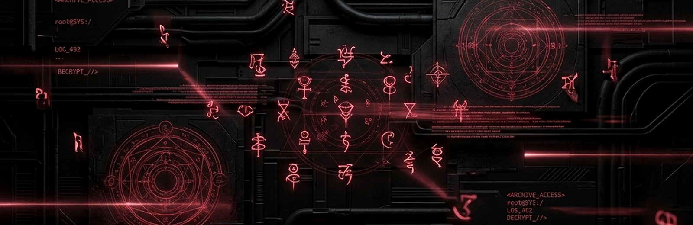
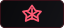
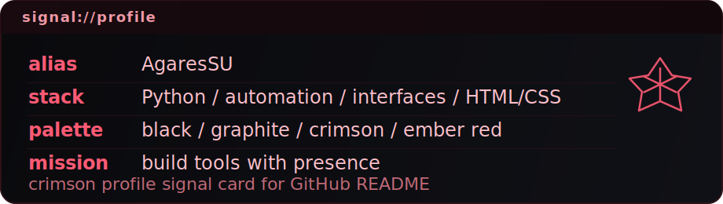

  

# AgaresSU

> Black. Graphite. Dark crimson. Precision over comfort.

Python-first developer building automation, sharp interfaces, and compact systems with a heavier cyberpunk edge.

  
  
  
  

## Signal

  

## What I Build

- Python tooling and automation that cut straight to the problem.
- Interfaces with HTML/CSS that feel sharp, controlled, and intentional.
- Small systems with a strong visual identity and zero generic-template energy.

## Active Zone

- turning rough experiments into portfolio pieces with actual weight
- sharpening repo structure, naming, and public presentation
- merging code and atmosphere into one recognizable style

## Ruleset

> If it ships, it should have presence.  
> If it solves a problem, it should do it fast.  
> If it looks generic, it gets rebuilt.

## Connect

- GitHub: [@AgaresSU](https://github.com/AgaresSU)
