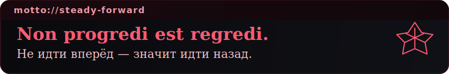
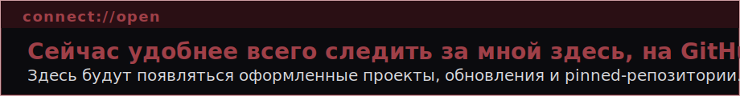

  

# AgaresSU

Привет. Я пишу в основном на Python и люблю делать вещи, которые реально упрощают работу: автоматизацию, небольшие инструменты и аккуратные интерфейсы на HTML/CSS.

Сейчас постепенно собираю свой GitHub в цельный профиль: привожу проекты в порядок, переписываю описания и превращаю черновики в портфолио, которое не стыдно показать.

  
  
  
  

## Обо мне

- основной язык для меня — `Python`
- люблю автоматизацию и небольшие инструменты с понятной пользой
- если проекту нужен интерфейс, мне важно, чтобы он был не только рабочим, но и аккуратным

## Сейчас в работе

- оформляю профиль и привожу репозитории к одному стилю
- довожу старые проекты до состояния, когда ими приятно пользоваться
- ищу баланс между кодом, визуалом и общей атмосферой проекта

## Девиз

  

## Связь

  

  

