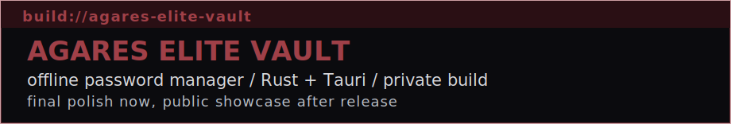

  

# AgaresSU

Привет. Я пишу в основном на Python и люблю делать вещи, которые реально упрощают работу: автоматизацию, небольшие инструменты и аккуратные интерфейсы на HTML/CSS.

  
  
  

## Обо мне

- основной язык для меня — `Python`
- люблю автоматизацию и небольшие инструменты с понятной пользой
- если проекту нужен интерфейс, мне важно, чтобы он был не только рабочим, но и аккуратным

## Сейчас в работе

- довожу до релиза `AGARES ELITE VAULT` — офлайн-менеджер паролей на `Rust + Tauri`
- довожу старые проекты до состояния, когда ими приятно пользоваться
- ищу баланс между кодом, визуалом и общей атмосферой проекта

## Проект в фокусе

  

`AGARES ELITE VAULT` — это мой офлайн-менеджер паролей, который я собираю как отдельный настольный инструмент без облака, телеметрии и зависимости от сети. Он рассчитан на локальное хранение, портативный запуск с USB и понятный, аккуратный интерфейс.

Сейчас проект уже почти у финиша: внутри есть `AES-256-GCM`, `Argon2id`, `panic / decoy vault`, `TOTP`, `SSH key storage`, `encrypted backups`, `auto-type`, `security audit` и двуязычный `EN / RU` интерфейс. Код пока живёт в приватном репозитории, а публичный showcase открою после финальной доводки и упаковки.

## Девиз

  

## Связь

  

  

